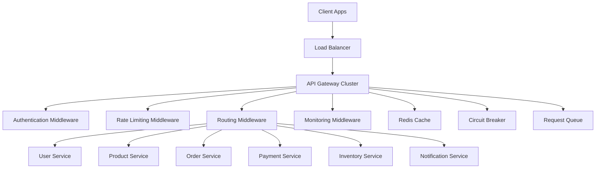

# API Gateway

## Central Request Router & Security Layer

The API Gateway serves as the single entry point for all client requests, providing authentication, routing, rate limiting, and monitoring for our microservices architecture.

## Key Responsibilities

- **Request Routing** - Intelligent routing to appropriate microservices
- **Authentication & Authorization** - JWT validation and RBAC enforcement
- **Rate Limiting** - Protection against abuse and DoS attacks
- **Load Balancing** - Distribution of traffic across service instances
- **API Versioning** - Support for multiple API versions
- **Request/Response Transformation** - Data format conversions
- **Monitoring & Logging** - Centralized observability

## Architecture



## Routing Configuration

### **Service Routes**
```javascript
// routes/serviceRoutes.js
const serviceRoutes = {
  '/api/auth': {
    target: process.env.USER_SERVICE_URL,
    pathRewrite: { '^/api/auth': '/auth' },
    changeOrigin: true,
    timeout: 5000,
    retries: 3
  },
  
  '/api/users': {
    target: process.env.USER_SERVICE_URL,
    pathRewrite: { '^/api/users': '/users' },
    auth: 'required',
    roles: ['user', 'admin']
  },
  
  '/api/products': {
    target: process.env.PRODUCT_SERVICE_URL,
    pathRewrite: { '^/api/products': '/products' },
    cache: {
      ttl: 300, // 5 minutes
      keys: ['GET']
    }
  },
  
  '/api/orders': {
    target: process.env.ORDER_SERVICE_URL,
    pathRewrite: { '^/api/orders': '/orders' },
    auth: 'required',
    rateLimit: {
      windowMs: 60000,
      max: 100
    }
  },
  
  '/api/payments': {
    target: process.env.PAYMENT_SERVICE_URL,
    pathRewrite: { '^/api/payments': '/payments' },
    auth: 'required',
    rateLimit: {
      windowMs: 60000,
      max: 20
    },
    security: 'high'
  }
};
```

## Authentication Middleware

### **JWT Validation**
```javascript
// middleware/auth.js
const authMiddleware = async (req, res, next) => {
  try {
    const token = extractToken(req);
    
    if (!token) {
      return res.status(401).json({
        error: {
          code: 'NO_TOKEN',
          message: 'Authentication token required'
        }
      });
    }
    
    // Verify JWT token
    const decoded = jwt.verify(token, process.env.JWT_SECRET);
    
    // Check token blacklist
    const isBlacklisted = await redis.get(`blacklist:${token}`);
    if (isBlacklisted) {
      return res.status(401).json({
        error: {
          code: 'TOKEN_BLACKLISTED',
          message: 'Token has been invalidated'
        }
      });
    }
    
    // Fetch user details
    const user = await userCache.get(decoded.userId);
    if (!user || !user.isActive) {
      return res.status(401).json({
        error: {
          code: 'USER_INACTIVE',
          message: 'User account is inactive'
        }
      });
    }
    
    // Add user context to request
    req.user = user;
    req.auth = {
      userId: user.id,
      role: user.role,
      permissions: user.permissions,
      tokenId: decoded.jti
    };
    
    next();
    
  } catch (error) {
    if (error.name === 'TokenExpiredError') {
      return res.status(401).json({
        error: {
          code: 'TOKEN_EXPIRED',
          message: 'Authentication token has expired'
        }
      });
    }
    
    return res.status(401).json({
      error: {
        code: 'INVALID_TOKEN',
        message: 'Invalid authentication token'
      }
    });
  }
};
```

## Rate Limiting

### **Advanced Rate Limiting**
```javascript
// middleware/rateLimiting.js
const RateLimiter = {
  // Different limits for different endpoint types
  limits: {
    auth: { windowMs: 60000, max: 5 },
    search: { windowMs: 60000, max: 100 },
    api: { windowMs: 60000, max: 1000 },
    payments: { windowMs: 60000, max: 10 },
    uploads: { windowMs: 60000, max: 5 }
  },
  
  async checkLimit(req, limitType = 'api') {
    const identifier = this.getIdentifier(req);
    const limit = this.limits[limitType];
    
    const key = `rate_limit:${limitType}:${identifier}`;
    const current = await redis.get(key);
    
    if (current && parseInt(current) >= limit.max) {
      const ttl = await redis.ttl(key);
      
      throw new Error('RATE_LIMIT_EXCEEDED', {
        limit: limit.max,
        window: limit.windowMs,
        resetTime: Date.now() + (ttl * 1000)
      });
    }
    
    // Increment counter
    const pipeline = redis.pipeline();
    pipeline.incr(key);
    pipeline.expire(key, Math.ceil(limit.windowMs / 1000));
    await pipeline.exec();
    
    return {
      limit: limit.max,
      remaining: limit.max - (parseInt(current) || 0) - 1,
      resetTime: Date.now() + limit.windowMs
    };
  },
  
  getIdentifier(req) {
    // Use user ID if authenticated, otherwise IP address
    return req.user?.id || req.ip;
  }
};
```

## Circuit Breaker Pattern

### **Service Resilience**
```javascript
// middleware/circuitBreaker.js
const CircuitBreaker = require('opossum');

const createCircuitBreaker = (serviceName, serviceCall) => {
  const options = {
    timeout: 5000,
    errorThresholdPercentage: 50,
    resetTimeout: 30000,
    rollingCountTimeout: 10000,
    rollingCountBuckets: 10
  };
  
  const breaker = new CircuitBreaker(serviceCall, options);
  
  // Circuit breaker events
  breaker.on('open', () => {
    logger.warn(`Circuit breaker opened for ${serviceName}`);
    metrics.circuitBreakerOpened.inc({ service: serviceName });
  });
  
  breaker.on('halfOpen', () => {
    logger.info(`Circuit breaker half-open for ${serviceName}`);
  });
  
  breaker.on('close', () => {
    logger.info(`Circuit breaker closed for ${serviceName}`);
  });
  
  // Fallback function
  breaker.fallback((error) => {
    logger.error(`Service ${serviceName} unavailable: ${error.message}`);
    return {
      error: 'SERVICE_UNAVAILABLE',
      message: `${serviceName} is temporarily unavailable`,
      timestamp: new Date().toISOString()
    };
  });
  
  return breaker;
};

// Usage for each service
const serviceBreakers = {
  userService: createCircuitBreaker('user-service', callUserService),
  productService: createCircuitBreaker('product-service', callProductService),
  orderService: createCircuitBreaker('order-service', callOrderService),
  paymentService: createCircuitBreaker('payment-service', callPaymentService)
};
```