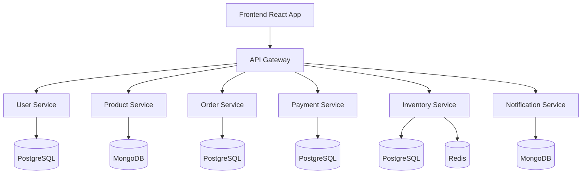

# Architecture Overview

## System Architecture

The e-commerce platform follows a **microservices architecture** pattern, providing:

- **Scalability** - Each service can be scaled independently
- **Maintainability** - Clear separation of concerns
- **Reliability** - Fault isolation and redundancy
- **Technology Diversity** - Best tool for each job

## Service Interaction Flow

## Design Principles

### **1. Domain-Driven Design**
Each microservice owns a specific business domain:
- **User Management** - Authentication, profiles, permissions
- **Product Catalog** - Products, categories, search
- **Order Processing** - Shopping cart, checkout, fulfillment
- **Payment Processing** - Billing, transactions, refunds
- **Inventory Management** - Stock levels, reservations
- **Notifications** - Email, SMS, push notifications

### **2. Database Per Service**
- **User Service** → PostgreSQL (ACID compliance for user data)
- **Product Service** → MongoDB (Flexible schema for product attributes)
- **Order Service** → PostgreSQL (Transactional integrity)
- **Payment Service** → PostgreSQL (Financial data consistency)
- **Inventory Service** → PostgreSQL + Redis (Real-time stock tracking)
- **Notification Service** → MongoDB (Message templates and logs)

### **3. API-First Development**
- RESTful APIs with OpenAPI specifications
- Consistent error handling and response formats
- Versioning strategy for backward compatibility
- Comprehensive API documentation

## Security Architecture

- **JWT Authentication** - Stateless token-based auth
- **API Gateway Security** - Centralized authentication and authorization
- **Service-to-Service** - Internal API authentication
- **Data Encryption** - At rest and in transit
- **Input Validation** - All endpoints protected against injection

## Data Architecture

### **Transactional Data**
- **Users** - PostgreSQL for ACID compliance
- **Orders** - PostgreSQL for financial integrity
- **Payments** - PostgreSQL for audit trails

### **Flexible Data**
- **Products** - MongoDB for varied product schemas
- **Notifications** - MongoDB for message templates

### **Performance Data**
- **Inventory** - Redis for real-time stock levels
- **Sessions** - Redis for user session management
- **Caching** - Redis for API response caching

## Scalability Strategy

- **Horizontal Scaling** - Add more service instances
- **Database Scaling** - Read replicas and sharding
- **Caching Strategy** - Multi-level caching with Redis
- **Load Balancing** - API Gateway with round-robin
- **Auto-scaling** - Kubernetes HPA for dynamic scaling