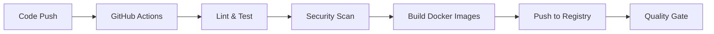
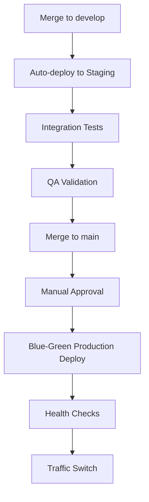

# Deployment Guide

## Deployment Strategy

Our e-commerce platform uses a **GitOps-based deployment strategy** with multiple environments and automated pipelines.

## Environments

### **Development** (Local)
- **Purpose**: Local development and testing
- **Infrastructure**: Docker Compose
- **Database**: Local PostgreSQL, MongoDB, Redis
- **Access**: http://localhost:3000

### **Staging** (AWS EKS)
- **Purpose**: Integration testing and QA
- **Infrastructure**: Kubernetes cluster (EKS)
- **Database**: RDS PostgreSQL, DocumentDB, ElastiCache
- **Access**: https://staging.ecommerce.company.com
- **Auto-deploy**: On push to `develop` branch

### **Production** (AWS EKS)
- **Purpose**: Live customer traffic
- **Infrastructure**: Multi-AZ Kubernetes cluster
- **Database**: RDS with read replicas, DocumentDB cluster
- **Access**: https://ecommerce.company.com
- **Deploy**: Manual approval from `main` branch

## CI/CD Pipeline

### **1. Continuous Integration**


### **2. Continuous Deployment**


## Container Strategy

### **Multi-stage Dockerfiles**
```dockerfile
# Example: User Service Dockerfile
FROM node:20-alpine AS builder
WORKDIR /app
COPY package*.json ./
RUN npm ci --only=production

FROM node:20-alpine AS runtime
RUN addgroup -g 1001 -S nodejs
RUN adduser -S nodejs -u 1001
WORKDIR /app
COPY --from=builder /app/node_modules ./node_modules
COPY --chown=nodejs:nodejs . .
USER nodejs
EXPOSE 3001
HEALTHCHECK --interval=30s --timeout=3s --start-period=5s --retries=3 \
  CMD curl -f http://localhost:3001/health || exit 1
CMD ["node", "src/index.js"]
```

### **Security Best Practices**
- **Non-root user**: All containers run as non-root
- **Read-only filesystem**: Where possible
- **Minimal base images**: Alpine Linux
- **Security scanning**: Trivy integration
- **Secrets management**: Kubernetes secrets

## Kubernetes Deployment

### **Deployment Manifests**
Each service includes:
- **Deployment**: Pod specification and replicas
- **Service**: Internal networking
- **ConfigMap**: Configuration data
- **Secret**: Sensitive data
- **HPA**: Horizontal Pod Autoscaler
- **PDB**: Pod Disruption Budget
- **NetworkPolicy**: Network security

### **Example: User Service Deployment**
```yaml
apiVersion: apps/v1
kind: Deployment
metadata:
  name: user-service
  labels:
    app: user-service
    component: authentication
spec:
  replicas: 3
  strategy:
    type: RollingUpdate
    rollingUpdate:
      maxSurge: 1
      maxUnavailable: 0
  template:
    spec:
      containers:
      - name: user-service
        image: ghcr.io/company/user-service:v1.2.3
        resources:
          requests:
            memory: "256Mi"
            cpu: "250m"
          limits:
            memory: "512Mi"
            cpu: "500m"
        livenessProbe:
          httpGet:
            path: /health
            port: 3001
        readinessProbe:
          httpGet:
            path: /ready
            port: 3001
```

## Blue-Green Deployment

### **Production Deployment Process**
1. **Blue Environment**: Current production (serving traffic)
2. **Green Environment**: New version deployment
3. **Health Checks**: Verify green environment health
4. **Traffic Switch**: Route traffic to green
5. **Monitoring**: Watch metrics for 30 minutes
6. **Cleanup**: Remove blue environment

### **Rollback Strategy**
```bash
# Immediate rollback (< 5 minutes)
kubectl patch service api-gateway -p '{"spec":{"selector":{"version":"blue"}}}'

# Gradual rollback with canary
kubectl argo rollouts set image user-service user-service=ghcr.io/company/user-service:previous-version
kubectl argo rollouts promote user-service
```

## Artifact Management

### **Container Registry**
- **Registry**: GitHub Container Registry (ghcr.io)
- **Naming**: `ghcr.io/company/service-name:tag`
- **Tagging Strategy**:
  - `latest` - Latest main branch
  - `v1.2.3` - Semantic versioning
  - `sha-abc123` - Git commit SHA
  - `staging` - Latest staging build

### **Helm Charts**
```bash
# Install platform
helm install ecommerce-platform ./charts/ecommerce-platform \
  --namespace production \
  --values values.production.yaml

# Upgrade platform
helm upgrade ecommerce-platform ./charts/ecommerce-platform \
  --namespace production \
  --values values.production.yaml

# Rollback deployment
helm rollback ecommerce-platform 1 --namespace production
```

## Security & Compliance

### **Image Scanning**
- **Trivy**: Vulnerability scanning in CI/CD
- **Admission Controller**: Block vulnerable images
- **Policy Enforcement**: OPA Gatekeeper rules

### **Runtime Security**
- **Falco**: Runtime threat detection
- **Pod Security Standards**: Restricted security context
- **Network Policies**: Micro-segmentation
- **RBAC**: Principle of least privilege

## Deployment Checklist

### **Pre-deployment**
- [ ] All tests passing
- [ ] Security scans clean
- [ ] Performance tests completed
- [ ] Database migrations ready
- [ ] Rollback plan prepared
- [ ] Monitoring alerts configured

### **During Deployment**
- [ ] Health checks passing
- [ ] Metrics within normal ranges
- [ ] Error rates stable
- [ ] Database connectivity verified
- [ ] Load balancer health checks passing

### **Post-deployment**
- [ ] Business metrics validation
- [ ] User acceptance testing
- [ ] Performance benchmark comparison
- [ ] Security posture assessment
- [ ] Documentation updated
- [ ] Team notification sent

## Infrastructure as Code

### **Terraform Configuration**
```hcl
# AWS EKS Cluster
module "eks" {
  source = "terraform-aws-modules/eks/aws"
  
  cluster_name    = "ecommerce-production"
  cluster_version = "1.28"
  
  vpc_id     = module.vpc.vpc_id
  subnet_ids = module.vpc.private_subnets
  
  node_groups = {
    main = {
      instance_types = ["m5.large"]
      min_size       = 3
      max_size       = 10
      desired_size   = 6
    }
  }
}

# RDS PostgreSQL
module "db" {
  source = "terraform-aws-modules/rds/aws"
  
  identifier = "ecommerce-main"
  engine     = "postgres"
  engine_version = "15.4"
  instance_class = "db.r5.xlarge"
  
  multi_az = true
  backup_retention_period = 30
  backup_window = "03:00-04:00"
  maintenance_window = "sun:04:00-sun:05:00"
}
```

### **GitOps with ArgoCD**
```yaml
apiVersion: argoproj.io/v1alpha1
kind: Application
metadata:
  name: ecommerce-platform
  namespace: argocd
spec:
  project: default
  source:
    repoURL: https://github.com/company/ecommerce-platform
    targetRevision: main
    path: infrastructure/k8s
  destination:
    server: https://kubernetes.default.svc
    namespace: production
  syncPolicy:
    automated:
      prune: true
      selfHeal: true
```

## Performance Optimization

### **Database Optimization**
- **Connection Pooling**: PgBouncer for PostgreSQL
- **Read Replicas**: Distribute read traffic
- **Caching**: Redis for frequently accessed data
- **Indexing**: Optimized database indexes

### **Application Optimization**
- **Code Splitting**: Frontend bundle optimization
- **API Caching**: Response caching strategies
- **CDN**: Static asset distribution
- **Compression**: Gzip/Brotli compression

### **Infrastructure Optimization**
- **Auto-scaling**: HPA and VPA for Kubernetes
- **Resource Limits**: Right-sized containers
- **Node Affinity**: Optimal pod placement
- **Storage**: EBS optimization for databases