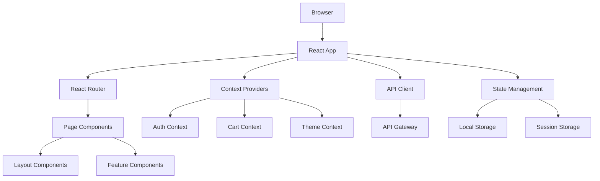

# Frontend Application

## React.js E-commerce Frontend

Modern, responsive e-commerce frontend built with React.js, providing an intuitive shopping experience for customers.

## Key Features

- **Responsive Design** - Mobile-first approach with responsive layouts
- **Product Browsing** - Advanced search, filtering, and category navigation
- **Shopping Cart** - Persistent cart with real-time updates
- **User Authentication** - Login, registration, and profile management
- **Checkout Process** - Streamlined checkout with multiple payment options
- **Order Tracking** - Real-time order status and delivery tracking

## Technical Architecture



## Project Structure

```
frontend/
├── src/
│   ├── components/
│   │   ├── layout/          # Header, Footer, Navigation
│   │   ├── auth/            # Login, Register, Profile
│   │   ├── product/         # ProductCard, ProductDetail
│   │   ├── cart/            # Cart, CartItem, Checkout
│   │   └── common/          # Button, Modal, Loading
│   ├── pages/              # Route components
│   ├── context/            # React Context providers
│   ├── hooks/              # Custom React hooks
│   ├── services/           # API integration
│   ├── utils/              # Helper functions
│   └── styles/             # CSS and styling
├── public/                 # Static assets
└── tests/                  # Test files
```

## Component Architecture

### **Layout Components**
```jsx
// Header.jsx - Main navigation
import React from 'react';
import { Link } from 'react-router-dom';
import { useAuth } from '../context/AuthContext';
import { useCart } from '../context/CartContext';

export const Header = () => {
  const { user, logout } = useAuth();
  const { cartItemCount } = useCart();
  
  return (
    <header className="header">
      <nav className="navbar">
        <Link to="/" className="logo">
          ECommerce
        </Link>
        
        <div className="nav-links">
          <Link to="/products">Products</Link>
          <Link to="/cart" className="cart-link">
            Cart ({cartItemCount})
          </Link>
          
          {user ? (
            <div className="user-menu">
              <Link to="/profile">{user.firstName}</Link>
              <button onClick={logout}>Logout</button>
            </div>
          ) : (
            <div className="auth-links">
              <Link to="/login">Login</Link>
              <Link to="/register">Register</Link>
            </div>
          )}
        </div>
      </nav>
    </header>
  );
};
```

### **Product Components**
```jsx
// ProductCard.jsx - Product list item
import React from 'react';
import { Link } from 'react-router-dom';
import { useCart } from '../context/CartContext';

export const ProductCard = ({ product }) => {
  const { addToCart } = useCart();
  
  const handleAddToCart = () => {
    addToCart({
      productId: product.id,
      quantity: 1,
      selectedAttributes: {}
    });
  };
  
  return (
    <div className="product-card">
      <Link to={`/products/${product.id}`}>
        
      </Link>
      
      <div className="product-info">
        <h3 className="product-name">
          <Link to={`/products/${product.id}`}>
            {product.name}
          </Link>
        </h3>
        
        <div className="product-price">
          ${product.price.amount}
        </div>
        
        <div className="product-rating">
          ⭐ {product.rating} ({product.reviewCount} reviews)
        </div>
        
        <button 
          onClick={handleAddToCart}
          className="add-to-cart-btn"
          disabled={!product.availability.inStock}
        >
          {product.availability.inStock ? 'Add to Cart' : 'Out of Stock'}
        </button>
      </div>
    </div>
  );
};
```

## State Management

### **Authentication Context**
```jsx
// context/AuthContext.jsx
import React, { createContext, useContext, useReducer, useEffect } from 'react';
import { authService } from '../services/api';

const AuthContext = createContext();

const authReducer = (state, action) => {
  switch (action.type) {
    case 'LOGIN_SUCCESS':
      return {
        ...state,
        user: action.payload.user,
        token: action.payload.token,
        isAuthenticated: true,
        loading: false
      };
      
    case 'LOGOUT':
      return {
        ...state,
        user: null,
        token: null,
        isAuthenticated: false,
        loading: false
      };
      
    case 'SET_LOADING':
      return {
        ...state,
        loading: action.payload
      };
      
    default:
      return state;
  }
};

export const AuthProvider = ({ children }) => {
  const [state, dispatch] = useReducer(authReducer, {
    user: null,
    token: localStorage.getItem('token'),
    isAuthenticated: false,
    loading: true
  });
  
  useEffect(() => {
    if (state.token) {
      authService.verifyToken(state.token)
        .then(user => {
          dispatch({ type: 'LOGIN_SUCCESS', payload: { user, token: state.token } });
        })
        .catch(() => {
          dispatch({ type: 'LOGOUT' });
          localStorage.removeItem('token');
        });
    } else {
      dispatch({ type: 'SET_LOADING', payload: false });
    }
  }, []);
  
  const login = async (credentials) => {
    dispatch({ type: 'SET_LOADING', payload: true });
    
    try {
      const response = await authService.login(credentials);
      localStorage.setItem('token', response.token);
      dispatch({ type: 'LOGIN_SUCCESS', payload: response });
      return response;
    } catch (error) {
      dispatch({ type: 'SET_LOADING', payload: false });
      throw error;
    }
  };
  
  const logout = () => {
    localStorage.removeItem('token');
    dispatch({ type: 'LOGOUT' });
  };
  
  return (
    <AuthContext.Provider value={{ ...state, login, logout }}>
      {children}
    </AuthContext.Provider>
  );
};

export const useAuth = () => {
  const context = useContext(AuthContext);
  if (!context) {
    throw new Error('useAuth must be used within AuthProvider');
  }
  return context;
};
```

### **Shopping Cart Context**
```jsx
// context/CartContext.jsx
import React, { createContext, useContext, useReducer, useEffect } from 'react';
import { cartService } from '../services/api';
import { useAuth } from './AuthContext';

const CartContext = createContext();

const cartReducer = (state, action) => {
  switch (action.type) {
    case 'SET_CART':
      return {
        ...state,
        items: action.payload.items,
        totals: action.payload.totals,
        itemCount: action.payload.itemCount
      };
      
    case 'ADD_ITEM':
      const existingItem = state.items.find(
        item => item.productId === action.payload.productId
      );
      
      if (existingItem) {
        return {
          ...state,
          items: state.items.map(item =>
            item.productId === action.payload.productId
              ? { ...item, quantity: item.quantity + action.payload.quantity }
              : item
          )
        };
      }
      
      return {
        ...state,
        items: [...state.items, action.payload]
      };
      
    case 'REMOVE_ITEM':
      return {
        ...state,
        items: state.items.filter(item => item.id !== action.payload.itemId)
      };
      
    case 'UPDATE_QUANTITY':
      return {
        ...state,
        items: state.items.map(item =>
          item.id === action.payload.itemId
            ? { ...item, quantity: action.payload.quantity }
            : item
        )
      };
      
    case 'CLEAR_CART':
      return {
        ...state,
        items: [],
        totals: { subtotal: 0, tax: 0, shipping: 0, total: 0 },
        itemCount: 0
      };
      
    default:
      return state;
  }
};

export const CartProvider = ({ children }) => {
  const { isAuthenticated, token } = useAuth();
  const [state, dispatch] = useReducer(cartReducer, {
    items: [],
    totals: { subtotal: 0, tax: 0, shipping: 0, total: 0 },
    itemCount: 0,
    loading: false
  });
  
  // Load cart when user logs in
  useEffect(() => {
    if (isAuthenticated && token) {
      loadCart();
    }
  }, [isAuthenticated, token]);
  
  const loadCart = async () => {
    try {
      const cart = await cartService.getCart(token);
      dispatch({ type: 'SET_CART', payload: cart });
    } catch (error) {
      console.error('Failed to load cart:', error);
    }
  };
  
  const addToCart = async (item) => {
    try {
      if (isAuthenticated) {
        await cartService.addItem(token, item);
        await loadCart(); // Refresh from server
      } else {
        // Add to local storage for guest users
        dispatch({ type: 'ADD_ITEM', payload: item });
      }
    } catch (error) {
      throw error;
    }
  };
  
  return (
    <CartContext.Provider value={{ ...state, addToCart, loadCart }}>
      {children}
    </CartContext.Provider>
  );
};

export const useCart = () => {
  const context = useContext(CartContext);
  if (!context) {
    throw new Error('useCart must be used within CartProvider');
  }
  return context;
};
```

## Responsive Design

### **Mobile-First CSS**
```css
/* Base styles for mobile */
.product-grid {
  display: grid;
  grid-template-columns: 1fr;
  gap: 1rem;
  padding: 1rem;
}

.product-card {
  background: white;
  border-radius: 8px;
  box-shadow: 0 2px 4px rgba(0, 0, 0, 0.1);
  overflow: hidden;
  transition: transform 0.2s;
}

.product-card:hover {
  transform: translateY(-2px);
  box-shadow: 0 4px 8px rgba(0, 0, 0, 0.15);
}

/* Tablet styles */
@media (min-width: 768px) {
  .product-grid {
    grid-template-columns: repeat(2, 1fr);
    gap: 1.5rem;
    padding: 1.5rem;
  }
}

/* Desktop styles */
@media (min-width: 1024px) {
  .product-grid {
    grid-template-columns: repeat(3, 1fr);
    gap: 2rem;
    padding: 2rem;
  }
}

/* Large desktop */
@media (min-width: 1440px) {
  .product-grid {
    grid-template-columns: repeat(4, 1fr);
    max-width: 1400px;
    margin: 0 auto;
  }
}
```