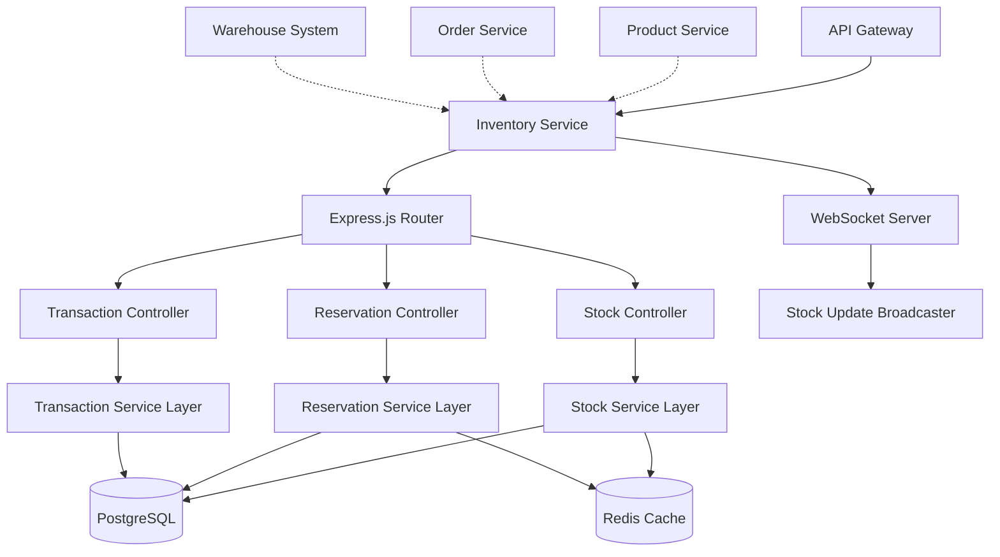

# Inventory Service

## Real-time Stock Management

The Inventory Service manages stock levels, reservations, and inventory tracking across multiple warehouses with real-time updates and high-performance caching.

## Key Responsibilities

- **Stock Level Management** - Real-time inventory tracking
- **Stock Reservations** - Temporary holds for order processing
- **Multi-warehouse Support** - Inventory across multiple locations
- **Low Stock Alerts** - Automated reorder notifications
- **Inventory Transactions** - Complete audit trail of stock movements
- **Real-time Updates** - WebSocket-based stock level broadcasting

## Technical Architecture



## Database Schema

### **Inventory Items Table**
```sql
CREATE TABLE inventory_items (
    id SERIAL PRIMARY KEY,
    product_id INTEGER NOT NULL,
    warehouse_id INTEGER NOT NULL,
    
    -- Stock quantities
    available_quantity INTEGER NOT NULL DEFAULT 0,
    reserved_quantity INTEGER NOT NULL DEFAULT 0,
    total_quantity INTEGER GENERATED ALWAYS AS (available_quantity + reserved_quantity) STORED,
    
    -- Reorder settings
    reorder_point INTEGER DEFAULT 10,
    reorder_quantity INTEGER DEFAULT 100,
    max_stock_level INTEGER DEFAULT 1000,
    
    -- Location details
    location_zone VARCHAR(10),
    location_aisle VARCHAR(10),
    location_shelf VARCHAR(10),
    
    -- Metadata
    last_count_date DATE,
    last_movement_at TIMESTAMP DEFAULT NOW(),
    created_at TIMESTAMP DEFAULT NOW(),
    updated_at TIMESTAMP DEFAULT NOW(),
    
    -- Constraints
    CONSTRAINT inventory_items_product_warehouse_unique UNIQUE (product_id, warehouse_id),
    CONSTRAINT inventory_items_quantities_positive CHECK (
        available_quantity >= 0 AND 
        reserved_quantity >= 0
    )
);

-- Performance indexes
CREATE INDEX idx_inventory_product_id ON inventory_items(product_id);
CREATE INDEX idx_inventory_warehouse_id ON inventory_items(warehouse_id);
CREATE INDEX idx_inventory_low_stock ON inventory_items(warehouse_id, available_quantity) 
    WHERE available_quantity <= reorder_point;
```

### **Stock Reservations Table**
```sql
CREATE TABLE stock_reservations (
    id SERIAL PRIMARY KEY,
    reservation_id VARCHAR(100) UNIQUE NOT NULL, -- order_id or cart_id
    product_id INTEGER NOT NULL,
    warehouse_id INTEGER NOT NULL,
    
    -- Reservation details
    quantity INTEGER NOT NULL,
    status reservation_status DEFAULT 'active',
    reservation_type VARCHAR(50) DEFAULT 'order', -- order, cart, manual
    
    -- Attributes for variant products
    product_attributes JSONB DEFAULT '{}',
    
    -- Expiration
    expires_at TIMESTAMP NOT NULL,
    created_at TIMESTAMP DEFAULT NOW(),
    released_at TIMESTAMP,
    
    -- References
    created_by INTEGER, -- user_id who created reservation
    released_by INTEGER, -- user_id who released reservation
    
    CONSTRAINT stock_reservations_quantity_positive CHECK (quantity > 0),
    CONSTRAINT stock_reservations_future_expiry CHECK (expires_at > created_at)
);

CREATE TYPE reservation_status AS ENUM ('active', 'expired', 'released', 'fulfilled');

-- Indexes
CREATE INDEX idx_reservations_product_warehouse ON stock_reservations(product_id, warehouse_id);
CREATE INDEX idx_reservations_reservation_id ON stock_reservations(reservation_id);
CREATE INDEX idx_reservations_expires_at ON stock_reservations(expires_at) WHERE status = 'active';
```

### **Inventory Transactions Table**
```sql
CREATE TABLE inventory_transactions (
    id SERIAL PRIMARY KEY,
    transaction_number VARCHAR(50) UNIQUE NOT NULL,
    
    -- Product and location
    product_id INTEGER NOT NULL,
    warehouse_id INTEGER NOT NULL,
    
    -- Transaction details
    transaction_type transaction_type NOT NULL,
    quantity_change INTEGER NOT NULL, -- positive for additions, negative for subtractions
    previous_quantity INTEGER NOT NULL,
    new_quantity INTEGER NOT NULL,
    
    -- Reference data
    reference_type VARCHAR(50), -- order, return, adjustment, receiving
    reference_id VARCHAR(100),  -- order_id, return_id, etc.
    
    -- Metadata
    reason VARCHAR(255),
    notes TEXT,
    cost_per_unit DECIMAL(10,2),
    total_cost DECIMAL(10,2),
    
    -- Audit trail
    created_by INTEGER, -- user_id
    created_at TIMESTAMP DEFAULT NOW(),
    
    -- Batch tracking
    batch_number VARCHAR(100),
    supplier_id INTEGER,
    received_date DATE,
    expiry_date DATE
);

CREATE TYPE transaction_type AS ENUM (
    'purchase',
    'sale', 
    'return',
    'adjustment',
    'transfer',
    'damage',
    'theft',
    'expired'
);

-- Indexes for reporting and auditing
CREATE INDEX idx_transactions_product_date ON inventory_transactions(product_id, created_at DESC);
CREATE INDEX idx_transactions_warehouse_date ON inventory_transactions(warehouse_id, created_at DESC);
CREATE INDEX idx_transactions_reference ON inventory_transactions(reference_type, reference_id);
```

## Real-time Stock Management

### **Redis Caching Strategy**
```javascript
// Real-time stock caching
const StockCache = {
  // Cache keys
  getStockKey: (productId, warehouseId) => `stock:${productId}:${warehouseId}`,
  getReservationKey: (reservationId) => `reservation:${reservationId}`,
  getProductStockKey: (productId) => `product_stock:${productId}`,
  
  // Get stock with caching
  async getStock(productId, warehouseId) {
    const cacheKey = this.getStockKey(productId, warehouseId);
    
    // Try cache first
    const cached = await redis.hgetall(cacheKey);
    if (cached && cached.available_quantity !== undefined) {
      return {
        productId: parseInt(productId),
        warehouseId: parseInt(warehouseId),
        availableQuantity: parseInt(cached.available_quantity),
        reservedQuantity: parseInt(cached.reserved_quantity),
        totalQuantity: parseInt(cached.total_quantity),
        lastUpdated: new Date(cached.last_updated)
      };
    }
    
    // Fetch from database
    const stock = await InventoryItem.findOne({
      where: { productId, warehouseId }
    });
    
    if (stock) {
      // Cache for 5 minutes
      await redis.hmset(cacheKey, {
        available_quantity: stock.availableQuantity,
        reserved_quantity: stock.reservedQuantity,
        total_quantity: stock.totalQuantity,
        last_updated: stock.updatedAt.toISOString()
      });
      await redis.expire(cacheKey, 300);
    }
    
    return stock;
  },
  
  // Update stock in cache and database
  async updateStock(productId, warehouseId, quantityChange, transactionData) {
    const transaction = await db.transaction();
    
    try {
      // Update database with row locking
      const stock = await InventoryItem.findOne({
        where: { productId, warehouseId },
        lock: true,
        transaction
      });
      
      if (!stock) {
        throw new Error('Stock record not found');
      }
      
      const newQuantity = stock.availableQuantity + quantityChange;
      if (newQuantity < 0) {
        throw new Error('Insufficient stock');
      }
      
      await stock.update({
        availableQuantity: newQuantity,
        lastMovementAt: new Date()
      }, { transaction });
      
      // Record transaction
      await InventoryTransaction.create({
        ...transactionData,
        productId,
        warehouseId,
        quantityChange,
        previousQuantity: stock.availableQuantity,
        newQuantity
      }, { transaction });
      
      await transaction.commit();
      
      // Update cache
      const cacheKey = this.getStockKey(productId, warehouseId);
      await redis.hmset(cacheKey, {
        available_quantity: newQuantity,
        reserved_quantity: stock.reservedQuantity,
        total_quantity: newQuantity + stock.reservedQuantity,
        last_updated: new Date().toISOString()
      });
      
      // Broadcast update via WebSocket
      await this.broadcastStockUpdate(productId, warehouseId, newQuantity);
      
      return newQuantity;
      
    } catch (error) {
      await transaction.rollback();
      throw error;
    }
  },
  
  // Broadcast real-time updates
  async broadcastStockUpdate(productId, warehouseId, newQuantity) {
    const updateData = {
      type: 'STOCK_UPDATE',
      productId,
      warehouseId,
      availableQuantity: newQuantity,
      timestamp: new Date().toISOString()
    };
    
    // Broadcast to WebSocket clients
    websocketServer.broadcast(`stock:${productId}`, updateData);
    
    // Publish to Redis pub/sub for other service instances
    await redis.publish('stock_updates', JSON.stringify(updateData));
  }
};
```

### **Stock Reservation System**
```javascript
// Advanced reservation management
const ReservationManager = {
  async createReservation(orderId, items, ttlSeconds = 1800) {
    const reservations = [];
    const transaction = await db.transaction();
    
    try {
      for (const item of items) {
        // Check availability
        const stock = await this.getAvailableStock(item.productId, item.warehouseId);
        if (stock < item.quantity) {
          throw new Error(`Insufficient stock for product ${item.productId}`);
        }
        
        // Create reservation
        const reservation = await StockReservation.create({
          reservationId: orderId,
          productId: item.productId,
          warehouseId: item.warehouseId,
          quantity: item.quantity,
          productAttributes: item.selectedAttributes || {},
          expiresAt: new Date(Date.now() + ttlSeconds * 1000),
          reservationType: 'order'
        }, { transaction });
        
        // Update inventory item
        await InventoryItem.increment('reservedQuantity', {
          by: item.quantity,
          where: { 
            productId: item.productId, 
            warehouseId: item.warehouseId 
          },
          transaction
        });
        
        reservations.push(reservation);
      }
      
      await transaction.commit();
      
      // Update cache
      for (const item of items) {
        await this.invalidateStockCache(item.productId, item.warehouseId);
      }
      
      // Schedule automatic expiration
      await this.scheduleReservationExpiry(orderId, ttlSeconds);
      
      return reservations;
      
    } catch (error) {
      await transaction.rollback();
      throw error;
    }
  },
  
  async releaseReservation(reservationId) {
    const reservations = await StockReservation.findAll({
      where: { reservationId, status: 'active' }
    });
    
    const transaction = await db.transaction();
    
    try {
      for (const reservation of reservations) {
        // Release reservation
        await reservation.update({
          status: 'released',
          releasedAt: new Date()
        }, { transaction });
        
        // Update inventory
        await InventoryItem.increment('reservedQuantity', {
          by: -reservation.quantity,
          where: {
            productId: reservation.productId,
            warehouseId: reservation.warehouseId
          },
          transaction
        });
        
        // Update cache
        await this.invalidateStockCache(reservation.productId, reservation.warehouseId);
      }
      
      await transaction.commit();
      
      // Cancel expiration job
      await this.cancelReservationExpiry(reservationId);
      
      return reservations.length;
      
    } catch (error) {
      await transaction.rollback();
      throw error;
    }
  }
};
```

## Performance Metrics

### **Real-time Dashboards**
```javascript
// Stock metrics for monitoring
const InventoryMetrics = {
  stockLevels: new promClient.Gauge({
    name: 'inventory_stock_levels',
    help: 'Current stock levels by product and warehouse',
    labelNames: ['product_id', 'warehouse_id', 'product_category']
  }),
  
  reservationRate: new promClient.Counter({
    name: 'inventory_reservations_total',
    help: 'Total stock reservations created',
    labelNames: ['warehouse_id', 'reservation_type']
  }),
  
  stockMovements: new promClient.Counter({
    name: 'inventory_movements_total',
    help: 'Total stock movements',
    labelNames: ['warehouse_id', 'movement_type', 'product_category']
  }),
  
  lowStockAlerts: new promClient.Gauge({
    name: 'inventory_low_stock_products',
    help: 'Number of products below reorder point',
    labelNames: ['warehouse_id']
  }),
  
  // Update metrics
  updateStockMetrics: async () => {
    const warehouses = await Warehouse.findAll();
    
    for (const warehouse of warehouses) {
      // Update stock level metrics
      const stockItems = await InventoryItem.findAll({
        where: { warehouseId: warehouse.id },
        include: [{ model: Product, include: [Category] }]
      });
      
      for (const item of stockItems) {
        this.stockLevels.set(
          { 
            product_id: item.productId,
            warehouse_id: item.warehouseId,
            product_category: item.Product.Category.name
          },
          item.availableQuantity
        );
      }
      
      // Count low stock items
      const lowStockCount = stockItems.filter(item => 
        item.availableQuantity <= item.reorderPoint
      ).length;
      
      this.lowStockAlerts.set(
        { warehouse_id: warehouse.id },
        lowStockCount
      );
    }
  }
};
```