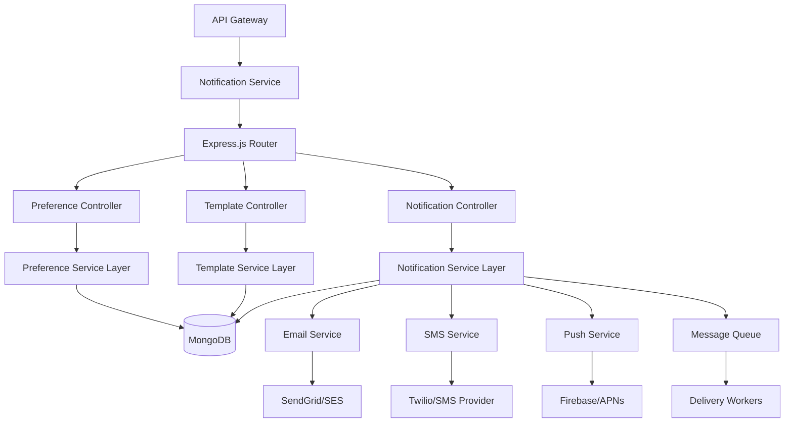

# Notification Service

## Multi-Channel Notification Management

The Notification Service handles all customer communications across email, SMS, and push notification channels with template management and delivery tracking.

## Key Responsibilities

- **Multi-Channel Delivery** - Email, SMS, push notifications
- **Template Management** - Dynamic message templates
- **Delivery Tracking** - Real-time delivery status monitoring
- **Preference Management** - User notification preferences
- **A/B Testing** - Message optimization and testing
- **Analytics** - Open rates, click rates, conversion tracking

## Technical Architecture



## Database Schema

### **Notifications Collection**
```javascript
// MongoDB document structure
{
  _id: ObjectId("64f8a123b456c789d012e345"),
  
  // Recipient information
  userId: 12345,
  recipientEmail: "customer@example.com",
  recipientPhone: "+1234567890",
  recipientDeviceTokens: ["fcm_token_123", "apns_token_456"],
  
  // Message details
  type: "order_shipped",
  subject: "Your order has been shipped!",
  content: {
    html: "<html>...</html>",
    text: "Your order #ORD-2024-001001 has been shipped...",
    variables: {
      orderNumber: "ORD-2024-001001",
      trackingNumber: "1Z999AA1234567890",
      customerName: "John Doe"
    }
  },
  
  // Channel configuration
  channels: ["email", "push"],
  priority: "normal", // low, normal, high, urgent
  
  // Delivery tracking
  delivery: {
    email: {
      status: "delivered",
      providerId: "sg_message_123",
      sentAt: ISODate("2024-01-15T10:30:00.000Z"),
      deliveredAt: ISODate("2024-01-15T10:30:05.000Z"),
      opened: true,
      openedAt: ISODate("2024-01-15T11:45:00.000Z"),
      clicked: false,
      bounced: false,
      complaint: false
    },
    push: {
      status: "delivered",
      providerId: "fcm_123456",
      sentAt: ISODate("2024-01-15T10:30:01.000Z"),
      deliveredAt: ISODate("2024-01-15T10:30:03.000Z"),
      clicked: true,
      clickedAt: ISODate("2024-01-15T10:32:00.000Z")
    }
  },
  
  // Template reference
  templateId: ObjectId("64f8a123b456c789d012e346"),
  templateVersion: "1.2",
  
  // Scheduling
  scheduledFor: ISODate("2024-01-15T10:30:00.000Z"),
  sentAt: ISODate("2024-01-15T10:30:00.000Z"),
  
  // Metadata
  campaign: "order_updates",
  source: "order_service",
  metadata: {
    orderId: 1001,
    orderValue: 2499.99,
    customerSegment: "premium"
  },
  
  // Timestamps
  createdAt: ISODate("2024-01-15T10:30:00.000Z"),
  updatedAt: ISODate("2024-01-15T11:45:00.000Z")
}
```

### **Templates Collection**
```javascript
{
  _id: ObjectId("64f8a123b456c789d012e346"),
  
  // Template identification
  name: "order_shipped",
  displayName: "Order Shipped Notification",
  description: "Notification sent when an order is shipped",
  category: "order_updates",
  
  // Versioning
  version: "1.2",
  isActive: true,
  isDefault: true,
  
  // Channel configurations
  channels: {
    email: {
      enabled: true,
      subject: "Your order {{orderNumber}} has been shipped! 📦",
      htmlTemplate: `
        <html>
          <body>
            <h1>Great news, {{customerName}}!</h1>
            <p>Your order <strong>{{orderNumber}}</strong> has been shipped and is on its way to you.</p>
            <div class="tracking-info">
              <h3>Tracking Information</h3>
              <p>Tracking Number: <strong>{{trackingNumber}}</strong></p>
              <p>Carrier: {{carrier}}</p>
              <p>Estimated Delivery: {{estimatedDelivery}}</p>
            </div>
            <a href="{{trackingUrl}}" class="track-button">Track Your Package</a>
          </body>
        </html>
      `,
      textTemplate: `
        Hi {{customerName}},
        
        Your order {{orderNumber}} has been shipped!
        
        Tracking Number: {{trackingNumber}}
        Carrier: {{carrier}}
        Estimated Delivery: {{estimatedDelivery}}
        
        Track your package: {{trackingUrl}}
        
        Thank you for your order!
      `,
      fromEmail: "orders@ecommerce.company.com",
      fromName: "ECommerce Orders"
    },
    
    sms: {
      enabled: true,
      template: "Your order {{orderNumber}} has shipped! Track: {{shortTrackingUrl}}"
    },
    
    push: {
      enabled: true,
      title: "Order Shipped 📦",
      body: "Your order {{orderNumber}} is on its way!",
      icon: "/icons/shipping.png",
      actions: [
        {
          action: "track",
          title: "Track Package",
          url: "{{trackingUrl}}"
        }
      ],
      data: {
        type: "order_shipped",
        orderId: "{{orderId}}"
      }
    }
  },
  
  // Required variables
  variables: [
    {
      name: "customerName",
      type: "string",
      required: true,
      description: "Customer's full name"
    },
    {
      name: "orderNumber", 
      type: "string",
      required: true,
      description: "Order number"
    },
    {
      name: "trackingNumber",
      type: "string",
      required: true,
      description: "Shipping tracking number"
    },
    {
      name: "carrier",
      type: "string",
      required: true,
      description: "Shipping carrier name"
    },
    {
      name: "estimatedDelivery",
      type: "date",
      required: true,
      description: "Estimated delivery date"
    }
  ],
  
  // A/B testing
  variants: [
    {
      name: "default",
      weight: 80,
      description: "Standard shipping notification"
    },
    {
      name: "urgent_delivery",
      weight: 20,
      description: "Emphasizes fast delivery",
      overrides: {
        email: {
          subject: "🚀 Your order {{orderNumber}} is speeding your way!"
        }
      }
    }
  ],
  
  // Metadata
  createdBy: 12345,
  lastModifiedBy: 12345,
  createdAt: ISODate("2024-01-01T00:00:00.000Z"),
  updatedAt: ISODate("2024-01-15T10:30:00.000Z")
}
```

## Notification Channels

### **Email Service Integration**
```javascript
// Email service implementation
const EmailService = {
  async sendEmail(notification) {
    const template = await this.getTemplate(notification.templateId);
    const renderedContent = await this.renderTemplate(template.channels.email, notification.variables);
    
    try {
      const response = await sendgrid.send({
        to: notification.recipientEmail,
        from: {
          email: template.channels.email.fromEmail,
          name: template.channels.email.fromName
        },
        subject: renderedContent.subject,
        html: renderedContent.html,
        text: renderedContent.text,
        customArgs: {
          notificationId: notification._id.toString(),
          userId: notification.userId.toString(),
          type: notification.type
        },
        trackingSettings: {
          clickTracking: { enable: true },
          openTracking: { enable: true },
          subscriptionTracking: { enable: false }
        }
      });
      
      // Update delivery status
      await this.updateDeliveryStatus(notification._id, 'email', {
        status: 'sent',
        providerId: response[0].messageId,
        sentAt: new Date()
      });
      
      return response;
      
    } catch (error) {
      await this.updateDeliveryStatus(notification._id, 'email', {
        status: 'failed',
        error: error.message,
        failedAt: new Date()
      });
      
      throw error;
    }
  },
  
  // Handle webhooks from SendGrid
  async handleWebhook(eventData) {
    const { event, email, sg_message_id } = eventData;
    
    // Find notification by provider ID
    const notification = await Notification.findOne({
      'delivery.email.providerId': sg_message_id
    });
    
    if (!notification) return;
    
    const updateData = {
      [`delivery.email.${event}`]: true,
      [`delivery.email.${event}At`]: new Date(eventData.timestamp * 1000)
    };
    
    await Notification.findByIdAndUpdate(notification._id, updateData);
    
    // Track metrics
    metrics.emailEvents.inc({
      event,
      template: notification.type
    });
  }
};
```

### **SMS Service Integration**
```javascript
// SMS service with Twilio
const SMSService = {
  async sendSMS(notification) {
    const template = await this.getTemplate(notification.templateId);
    const message = await this.renderTemplate(template.channels.sms, notification.variables);
    
    try {
      const response = await twilio.messages.create({
        to: notification.recipientPhone,
        from: process.env.TWILIO_PHONE_NUMBER,
        body: message,
        statusCallback: `${process.env.BASE_URL}/webhooks/sms/status`,
        provideFeedback: true
      });
      
      await this.updateDeliveryStatus(notification._id, 'sms', {
        status: 'sent',
        providerId: response.sid,
        sentAt: new Date()
      });
      
      return response;
      
    } catch (error) {
      await this.updateDeliveryStatus(notification._id, 'sms', {
        status: 'failed',
        error: error.message,
        failedAt: new Date()
      });
      
      throw error;
    }
  }
};
```

### **Push Notification Service**
```javascript
// Push notifications with Firebase
const PushService = {
  async sendPushNotification(notification) {
    const template = await this.getTemplate(notification.templateId);
    const pushConfig = template.channels.push;
    
    const message = {
      notification: {
        title: this.renderString(pushConfig.title, notification.variables),
        body: this.renderString(pushConfig.body, notification.variables),
        icon: pushConfig.icon
      },
      data: this.renderObject(pushConfig.data, notification.variables),
      tokens: notification.recipientDeviceTokens
    };
    
    try {
      const response = await admin.messaging().sendMulticast(message);
      
      // Process results
      const results = response.responses.map((result, index) => ({
        token: message.tokens[index],
        success: result.success,
        messageId: result.messageId,
        error: result.error?.code
      }));
      
      await this.updateDeliveryStatus(notification._id, 'push', {
        status: response.failureCount === 0 ? 'delivered' : 'partial',
        deliveredCount: response.successCount,
        failedCount: response.failureCount,
        results: results,
        sentAt: new Date()
      });
      
      return response;
      
    } catch (error) {
      await this.updateDeliveryStatus(notification._id, 'push', {
        status: 'failed',
        error: error.message,
        failedAt: new Date()
      });
      
      throw error;
    }
  }
};
```