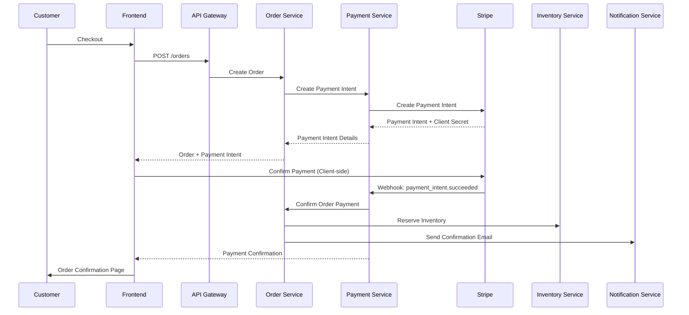

# Payment Service

## Payment Processing & Financial Operations

The Payment Service handles all financial transactions, payment method management, billing operations, and ensures PCI DSS compliance across the platform.

## Key Responsibilities

- **Payment Processing** - Credit card, digital wallet, bank transfer processing
- **Payment Methods** - Customer payment method management
- **Billing Operations** - Invoicing, recurring billing, taxation
- **Refund Management** - Full and partial refund processing
- **Fraud Detection** - Transaction monitoring and risk assessment
- **Compliance** - PCI DSS, SOX, and financial regulations

## Technical Architecture

```mermaid
graph TD
    A[API Gateway] --> B[Payment Service]
    B --> C[Express.js Router]
    
    C --> D[Payment Controller]
    C --> E[Method Controller]
    C --> F[Refund Controller]
    C --> G[Webhook Controller]
    
    D --> H[Payment Service Layer]
    E --> I[Method Service Layer]
    F --> J[Refund Service Layer]
    
    H --> K[(PostgreSQL)]
    I --> K
    J --> K
    
    H --> L[Stripe API]
    H --> M[PayPal API]
    H --> N[Bank Transfer API]
    
    H --> O[Fraud Detection]
    H --> P[Risk Assessment]
    
    Q[Order Service] --> B
    R[Notification Service] <-- B
```

## Database Schema

### **Payments Table**
```sql
CREATE TABLE payments (
    id SERIAL PRIMARY KEY,
    payment_number VARCHAR(20) UNIQUE NOT NULL,
    
    -- Order reference
    order_id INTEGER NOT NULL,
    user_id INTEGER NOT NULL,
    
    -- Payment details
    amount DECIMAL(10,2) NOT NULL,
    currency VARCHAR(3) NOT NULL DEFAULT 'USD',
    status payment_status NOT NULL DEFAULT 'pending',
    
    -- Payment method
    payment_method_id INTEGER,
    payment_type payment_type NOT NULL,
    
    -- External provider details
    provider VARCHAR(50) NOT NULL, -- stripe, paypal, bank
    provider_payment_id VARCHAR(255),
    provider_charge_id VARCHAR(255),
    provider_fee DECIMAL(10,2) DEFAULT 0,
    
    -- Transaction details
    description TEXT,
    statement_descriptor VARCHAR(50),
    receipt_email VARCHAR(255),
    receipt_url VARCHAR(500),
    
    -- Risk assessment
    risk_score INTEGER DEFAULT 0,
    risk_level risk_level DEFAULT 'low',
    fraud_check_result JSONB,
    
    -- Metadata
    metadata JSONB DEFAULT '{}',
    internal_notes TEXT,
    
    -- Timestamps
    created_at TIMESTAMP DEFAULT NOW(),
    updated_at TIMESTAMP DEFAULT NOW(),
    processed_at TIMESTAMP,
    failed_at TIMESTAMP,
    
    -- Constraints
    CONSTRAINT payments_amount_positive CHECK (amount > 0),
    CONSTRAINT payments_order_id_fkey FOREIGN KEY (order_id) REFERENCES orders(id)
);

-- Custom enum types
CREATE TYPE payment_status AS ENUM (
    'pending',
    'processing',
    'succeeded',
    'failed',
    'cancelled',
    'refunded',
    'partially_refunded'
);

CREATE TYPE payment_type AS ENUM (
    'card',
    'bank_transfer',
    'digital_wallet',
    'cryptocurrency',
    'gift_card'
);

CREATE TYPE risk_level AS ENUM (
    'low',
    'medium', 
    'high',
    'blocked'
);
```

### **Payment Methods Table**
```sql
CREATE TABLE payment_methods (
    id SERIAL PRIMARY KEY,
    user_id INTEGER NOT NULL,
    
    -- Method details
    type payment_type NOT NULL,
    provider VARCHAR(50) NOT NULL,
    provider_method_id VARCHAR(255) NOT NULL,
    
    -- Display information
    display_name VARCHAR(100),
    last_four VARCHAR(4),
    brand VARCHAR(50), -- visa, mastercard, amex
    exp_month INTEGER,
    exp_year INTEGER,
    
    -- Billing address
    billing_address JSONB,
    
    -- Status
    is_default BOOLEAN DEFAULT false,
    is_active BOOLEAN DEFAULT true,
    
    -- Metadata
    metadata JSONB DEFAULT '{}',
    
    created_at TIMESTAMP DEFAULT NOW(),
    updated_at TIMESTAMP DEFAULT NOW(),
    
    -- Constraints
    CONSTRAINT payment_methods_user_id_fkey FOREIGN KEY (user_id) REFERENCES users(id),
    CONSTRAINT payment_methods_exp_date_valid CHECK (
        exp_month BETWEEN 1 AND 12 AND 
        exp_year >= EXTRACT(YEAR FROM NOW())
    )
);

CREATE INDEX idx_payment_methods_user_id ON payment_methods(user_id);
CREATE INDEX idx_payment_methods_provider ON payment_methods(provider, provider_method_id);
```

### **Refunds Table**
```sql
CREATE TABLE refunds (
    id SERIAL PRIMARY KEY,
    refund_number VARCHAR(20) UNIQUE NOT NULL,
    
    -- References
    payment_id INTEGER NOT NULL,
    order_id INTEGER NOT NULL,
    
    -- Refund details
    amount DECIMAL(10,2) NOT NULL,
    currency VARCHAR(3) NOT NULL,
    reason refund_reason NOT NULL,
    status refund_status NOT NULL DEFAULT 'pending',
    
    -- Provider details
    provider_refund_id VARCHAR(255),
    provider_fee DECIMAL(10,2) DEFAULT 0,
    
    -- Processing
    requested_by INTEGER, -- user_id of person requesting refund
    approved_by INTEGER,  -- admin user_id who approved
    processed_by INTEGER, -- system or admin user_id
    
    -- Details
    description TEXT,
    internal_notes TEXT,
    customer_reason TEXT,
    
    created_at TIMESTAMP DEFAULT NOW(),
    processed_at TIMESTAMP,
    
    CONSTRAINT refunds_payment_id_fkey FOREIGN KEY (payment_id) REFERENCES payments(id),
    CONSTRAINT refunds_amount_positive CHECK (amount > 0)
);

CREATE TYPE refund_reason AS ENUM (
    'customer_request',
    'order_cancelled',
    'product_unavailable',
    'quality_issue',
    'shipping_issue',
    'duplicate_charge',
    'fraud_chargeback'
);

CREATE TYPE refund_status AS ENUM (
    'pending',
    'approved',
    'processing',
    'succeeded',
    'failed',
    'cancelled'
);
```

## API Endpoints

### **Payment Processing**

#### **POST /payments/process**
```javascript
// Process payment for order
// Authorization: Bearer {token}

// Request
{
  "orderId": 1001,
  "paymentMethodId": "pm_1234567890",
  "amount": 2499.99,
  "currency": "USD",
  "description": "Order #ORD-2024-001001",
  "metadata": {
    "orderNumber": "ORD-2024-001001",
    "customerId": "cus_1234567890"
  }
}

// Response
{
  "payment": {
    "id": "pay_1234567890",
    "paymentNumber": "PAY-2024-001001",
    "status": "succeeded",
    "amount": 2499.99,
    "currency": "USD",
    "paymentMethod": {
      "type": "card",
      "brand": "visa",
      "lastFour": "4242",
      "expMonth": 12,
      "expYear": 2025
    },
    "receipt": {
      "url": "https://pay.stripe.com/receipts/123",
      "email": "customer@example.com"
    },
    "riskAssessment": {
      "score": 25,
      "level": "low",
      "checks": {
        "cvc": "pass",
        "addressLine1": "pass",
        "postalCode": "pass"
      }
    },
    "processedAt": "2024-01-15T10:30:00.000Z"
  },
  "transaction": {
    "id": "txn_1234567890",
    "fee": 75.47,
    "net": 2424.52
  }
}
```

#### **GET /payments/{id}/status**
```javascript
// Get payment status
// Authorization: Bearer {token}

// Response
{
  "id": "pay_1234567890",
  "status": "succeeded",
  "amount": 2499.99,
  "currency": "USD",
  "timeline": [
    {
      "status": "pending",
      "timestamp": "2024-01-15T10:30:00.000Z",
      "description": "Payment initiated"
    },
    {
      "status": "processing", 
      "timestamp": "2024-01-15T10:30:05.000Z",
      "description": "Processing with payment provider"
    },
    {
      "status": "succeeded",
      "timestamp": "2024-01-15T10:30:12.000Z",
      "description": "Payment completed successfully"
    }
  ],
  "details": {
    "chargeId": "ch_1234567890",
    "receiptUrl": "https://pay.stripe.com/receipts/123",
    "failureReason": null
  }
}
```

### **Payment Methods Management**

#### **GET /payment-methods**
```javascript
// Get user's payment methods
// Authorization: Bearer {token}

// Response
{
  "paymentMethods": [
    {
      "id": "pm_1234567890",
      "type": "card",
      "isDefault": true,
      "displayName": "Visa ****4242",
      "card": {
        "brand": "visa",
        "lastFour": "4242",
        "expMonth": 12,
        "expYear": 2025,
        "country": "US"
      },
      "billingDetails": {
        "name": "John Doe",
        "email": "john@example.com",
        "address": {
          "line1": "123 Main St",
          "city": "Anytown",
          "state": "CA",
          "postalCode": "12345",
          "country": "US"
        }
      },
      "createdAt": "2024-01-10T08:20:00.000Z"
    }
  ],
  "defaultMethodId": "pm_1234567890"
}
```

## Security & Compliance

### **PCI DSS Compliance**
```javascript
// PCI-compliant payment processing
const processSecurePayment = async (paymentData) => {
  // Never store raw card data
  if (paymentData.cardNumber) {
    throw new Error('Raw card data not allowed');
  }
  
  // Use tokenized payment methods only
  const paymentMethod = await getTokenizedPaymentMethod(paymentData.paymentMethodId);
  
  // Create payment with Stripe (PCI-compliant provider)
  const paymentIntent = await stripe.paymentIntents.create({
    amount: Math.round(paymentData.amount * 100), // Stripe uses cents
    currency: paymentData.currency.toLowerCase(),
    payment_method: paymentMethod.stripeId,
    confirmation_method: 'manual',
    confirm: true,
    
    // Required for SCA compliance
    use_stripe_sdk: true,
    
    // Metadata for tracking (no sensitive data)
    metadata: {
      orderId: paymentData.orderId,
      customerId: paymentData.customerId,
      environment: process.env.NODE_ENV
    }
  });
  
  // Store only non-sensitive payment data
  const payment = await Payment.create({
    orderId: paymentData.orderId,
    userId: paymentData.customerId,
    amount: paymentData.amount,
    currency: paymentData.currency,
    providerPaymentId: paymentIntent.id,
    status: mapStripeStatus(paymentIntent.status),
    riskScore: paymentIntent.charges.data[0]?.outcome?.risk_score || 0
  });
  
  return payment;
};
```

### **Fraud Detection**
```javascript
// Fraud detection system
const FraudDetection = {
  async assessRisk(paymentData, userContext) {
    let riskScore = 0;
    const riskFactors = [];
    
    // Velocity checks
    const recentPayments = await this.getRecentPayments(userContext.userId, '1h');
    if (recentPayments.length > 5) {
      riskScore += 30;
      riskFactors.push('HIGH_VELOCITY');
    }
    
    // Amount checks
    if (paymentData.amount > userContext.averageOrderValue * 3) {
      riskScore += 20;
      riskFactors.push('UNUSUAL_AMOUNT');
    }
    
    // Geographic checks
    const ipCountry = await this.getCountryFromIP(userContext.ipAddress);
    if (ipCountry !== userContext.billingCountry) {
      riskScore += 15;
      riskFactors.push('GEO_MISMATCH');
    }
    
    // Time-based checks
    const hour = new Date().getHours();
    if (hour < 6 || hour > 23) {
      riskScore += 10;
      riskFactors.push('UNUSUAL_TIME');
    }
    
    // Device fingerprinting
    if (userContext.deviceFingerprint !== userContext.lastKnownDevice) {
      riskScore += 25;
      riskFactors.push('NEW_DEVICE');
    }
    
    return {
      score: riskScore,
      level: this.getRiskLevel(riskScore),
      factors: riskFactors,
      recommendation: this.getRecommendation(riskScore)
    };
  },
  
  getRiskLevel(score) {
    if (score >= 70) return 'high';
    if (score >= 40) return 'medium';
    return 'low';
  },
  
  getRecommendation(score) {
    if (score >= 70) return 'block';
    if (score >= 40) return 'review';
    return 'approve';
  }
};
```

## Payment Flow

### **Standard Payment Flow**


### **3D Secure Authentication**
```javascript
// Handle 3D Secure authentication
const handle3DSecure = async (paymentIntentId, returnUrl) => {
  const paymentIntent = await stripe.paymentIntents.retrieve(paymentIntentId);
  
  if (paymentIntent.status === 'requires_action') {
    // Client needs to authenticate
    return {
      requiresAction: true,
      clientSecret: paymentIntent.client_secret,
      nextAction: paymentIntent.next_action
    };
  }
  
  if (paymentIntent.status === 'succeeded') {
    // Payment completed
    await this.confirmPaymentSuccess(paymentIntentId);
    return {
      success: true,
      paymentId: paymentIntent.id
    };
  }
  
  throw new Error(`Unexpected payment status: ${paymentIntent.status}`);
};
```

## Financial Operations

### **Refund Processing**
```javascript
const processRefund = async (paymentId, refundData) => {
  const payment = await Payment.findById(paymentId);
  
  if (payment.status !== 'succeeded') {
    throw new Error('Can only refund successful payments');
  }
  
  const transaction = await db.transaction();
  
  try {
    // Calculate refund amount
    const maxRefundable = payment.amount - payment.totalRefunded;
    const refundAmount = Math.min(refundData.amount, maxRefundable);
    
    // Create refund record
    const refund = await Refund.create({
      paymentId: payment.id,
      orderId: payment.orderId,
      amount: refundAmount,
      currency: payment.currency,
      reason: refundData.reason,
      description: refundData.description,
      requestedBy: refundData.userId
    }, { transaction });
    
    // Process refund with provider
    let providerRefund;
    switch (payment.provider) {
      case 'stripe':
        providerRefund = await stripe.refunds.create({
          payment_intent: payment.providerPaymentId,
          amount: Math.round(refundAmount * 100), // Convert to cents
          reason: mapRefundReason(refundData.reason),
          metadata: {
            refundId: refund.id,
            orderId: payment.orderId
          }
        });
        break;
        
      case 'paypal':
        providerRefund = await paypal.refunds.create({
          // PayPal refund implementation
        });
        break;
    }
    
    // Update refund with provider details
    await refund.update({
      providerRefundId: providerRefund.id,
      status: 'processing',
      processedAt: new Date()
    }, { transaction });
    
    await transaction.commit();
    
    // Send refund notification
    await notificationService.sendRefundNotification(payment.userId, {
      orderId: payment.orderId,
      refundAmount: refundAmount,
      expectedDate: this.calculateRefundDate(payment.paymentMethod)
    });
    
    return refund;
    
  } catch (error) {
    await transaction.rollback();
    throw error;
  }
};
```

### **Recurring Billing**
```javascript
// Subscription and recurring billing
const RecurringBilling = {
  async createSubscription(userId, planData) {
    const customer = await this.getOrCreateStripeCustomer(userId);
    
    const subscription = await stripe.subscriptions.create({
      customer: customer.id,
      items: [{
        price: planData.stripePriceId,
        quantity: planData.quantity || 1
      }],
      collection_method: 'charge_automatically',
      billing_cycle_anchor: planData.billingCycleAnchor,
      trial_period_days: planData.trialDays,
      metadata: {
        userId: userId,
        planName: planData.name
      }
    });
    
    return await Subscription.create({
      userId,
      stripeSubscriptionId: subscription.id,
      status: subscription.status,
      currentPeriodStart: new Date(subscription.current_period_start * 1000),
      currentPeriodEnd: new Date(subscription.current_period_end * 1000),
      planData: planData
    });
  },
  
  async handleSubscriptionWebhook(event) {
    const subscription = event.data.object;
    
    switch (event.type) {
      case 'invoice.payment_succeeded':
        await this.recordSubscriptionPayment(subscription);
        break;
        
      case 'invoice.payment_failed':
        await this.handleFailedPayment(subscription);
        break;
        
      case 'customer.subscription.deleted':
        await this.cancelSubscription(subscription);
        break;
    }
  }
};
```

## Financial Reporting

### **Revenue Analytics**
```javascript
// Revenue reporting and analytics
const RevenueAnalytics = {
  async getDailyRevenue(startDate, endDate) {
    const result = await db.query(`
      SELECT 
        DATE(processed_at) as date,
        COUNT(*) as transaction_count,
        SUM(amount) as gross_revenue,
        SUM(provider_fee) as processing_fees,
        SUM(amount - provider_fee) as net_revenue,
        AVG(amount) as average_transaction_value
      FROM payments 
      WHERE status = 'succeeded' 
        AND processed_at BETWEEN $1 AND $2
      GROUP BY DATE(processed_at)
      ORDER BY date DESC
    `, [startDate, endDate]);
    
    return result.rows.map(row => ({
      date: row.date,
      transactionCount: parseInt(row.transaction_count),
      grossRevenue: parseFloat(row.gross_revenue),
      processingFees: parseFloat(row.processing_fees),
      netRevenue: parseFloat(row.net_revenue),
      averageTransactionValue: parseFloat(row.average_transaction_value)
    }));
  },
  
  async getPaymentMethodBreakdown(period = '30d') {
    const result = await db.query(`
      SELECT 
        payment_type,
        COUNT(*) as transaction_count,
        SUM(amount) as total_amount,
        AVG(amount) as average_amount
      FROM payments 
      WHERE status = 'succeeded' 
        AND processed_at > NOW() - INTERVAL '${period}'
      GROUP BY payment_type
      ORDER BY total_amount DESC
    `);
    
    return result.rows;
  }
};
```

## Security Implementation

### **Payment Data Security**
```javascript
// Secure payment data handling
const PaymentSecurity = {
  // Never store sensitive payment data
  sanitizePaymentData(paymentData) {
    const sanitized = { ...paymentData };
    
    // Remove sensitive fields
    delete sanitized.cardNumber;
    delete sanitized.cvv;
    delete sanitized.expiryDate;
    delete sanitized.pin;
    
    return sanitized;
  },
  
  // Encrypt stored payment metadata
  encryptMetadata(metadata) {
    const cipher = crypto.createCipher('aes-256-gcm', process.env.ENCRYPTION_KEY);
    let encrypted = cipher.update(JSON.stringify(metadata), 'utf8', 'hex');
    encrypted += cipher.final('hex');
    return encrypted;
  },
  
  // Audit all payment operations
  async auditPaymentOperation(userId, operation, details) {
    await PaymentAuditLog.create({
      userId,
      operation, // 'payment_created', 'refund_processed', etc.
      details: this.sanitizePaymentData(details),
      ipAddress: details.ipAddress,
      userAgent: details.userAgent,
      timestamp: new Date()
    });
  },
  
  // Rate limiting for sensitive operations
  async checkRateLimit(userId, operation) {
    const key = `rate_limit:${userId}:${operation}`;
    const current = await redis.get(key);
    
    if (current && parseInt(current) >= this.limits[operation]) {
      throw new Error('Rate limit exceeded');
    }
    
    await redis.incr(key);
    await redis.expire(key, this.windows[operation]);
  }
};
```

## Testing Strategy

### **Payment Testing**
```javascript
// tests/integration/paymentFlow.test.js
describe('Payment Flow Integration', () => {
  beforeEach(async () => {
    // Use Stripe test mode
    stripe.setApiKey(process.env.STRIPE_TEST_SECRET_KEY);
  });
  
  it('should process successful payment', async () => {
    const order = await createTestOrder();
    const paymentMethod = await createTestPaymentMethod();
    
    const response = await request(app)
      .post('/payments/process')
      .set('Authorization', `Bearer ${userToken}`)
      .send({
        orderId: order.id,
        paymentMethodId: paymentMethod.id,
        amount: order.totalAmount,
        currency: 'USD'
      })
      .expect(200);
    
    expect(response.body.payment.status).toBe('succeeded');
    
    // Verify order was updated
    const updatedOrder = await Order.findById(order.id);
    expect(updatedOrder.status).toBe('confirmed');
  });
  
  it('should handle payment failure gracefully', async () => {
    const order = await createTestOrder();
    
    // Use Stripe test card that will be declined
    const response = await request(app)
      .post('/payments/process')
      .set('Authorization', `Bearer ${userToken}`)
      .send({
        orderId: order.id,
        paymentMethodId: 'pm_card_visa_chargeDeclined',
        amount: order.totalAmount
      })
      .expect(400);
    
    expect(response.body.error.code).toBe('PAYMENT_DECLINED');
    
    // Verify order status
    const updatedOrder = await Order.findById(order.id);
    expect(updatedOrder.status).toBe('payment_failed');
  });
});
```

## Performance Optimization

### **Database Optimization**
```sql
-- Partitioning for large payment tables
CREATE TABLE payments_2024 PARTITION OF payments
FOR VALUES FROM ('2024-01-01') TO ('2025-01-01');

-- Indexes for common queries
CREATE INDEX idx_payments_user_date ON payments(user_id, processed_at DESC);
CREATE INDEX idx_payments_provider_id ON payments(provider, provider_payment_id);
CREATE INDEX idx_payments_status_date ON payments(status, processed_at DESC);

-- Partial indexes for active data
CREATE INDEX idx_payments_pending ON payments(created_at) 
WHERE status IN ('pending', 'processing');
```

### **Caching Strategy**
```javascript
// Cache payment method data
const getPaymentMethods = async (userId) => {
  const cacheKey = `payment_methods:${userId}`;
  
  // Try cache first
  const cached = await redis.get(cacheKey);
  if (cached) {
    return JSON.parse(cached);
  }
  
  // Fetch from database
  const methods = await PaymentMethod.findByUserId(userId);
  
  // Cache for 30 minutes
  await redis.setex(cacheKey, 1800, JSON.stringify(methods));
  
  return methods;
};
```