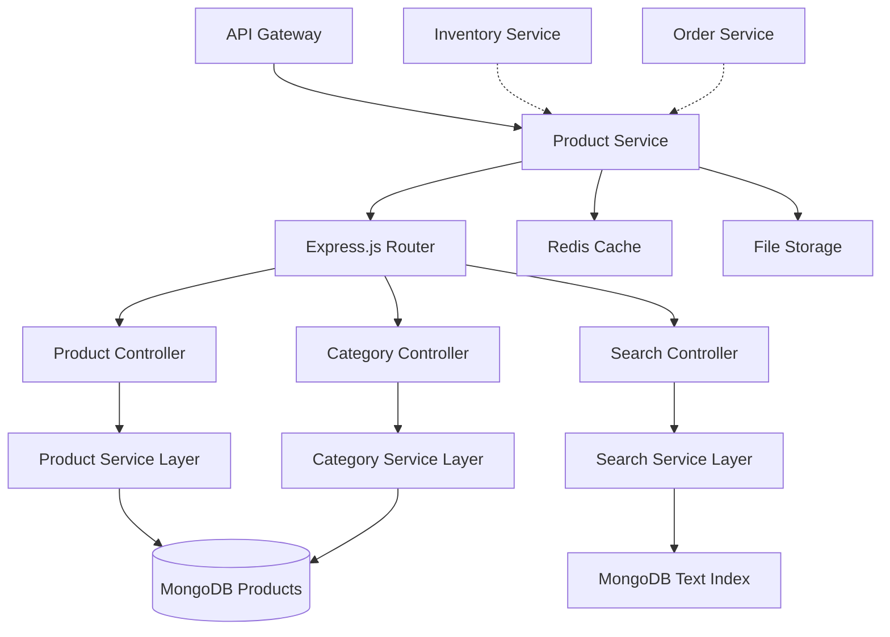

# Product Service

## Product Catalog Management

The Product Service is the heart of our e-commerce platform, managing the complete product catalog, categories, search functionality, and product metadata.

## Key Responsibilities

- **Product Management** - CRUD operations for products
- **Category Management** - Hierarchical category structure
- **Search & Discovery** - Full-text search with filtering
- **Inventory Integration** - Real-time stock level tracking
- **Media Management** - Product images and videos
- **Pricing Engine** - Dynamic pricing and promotions

## Technical Architecture



## Database Design

### **Products Collection**
```javascript
{
  _id: ObjectId("64f8a123b456c789d012e345"),
  name: "MacBook Pro 16-inch",
  slug: "macbook-pro-16-inch",
  description: "High-performance laptop for professionals",
  shortDescription: "Professional laptop with M3 Pro chip",
  
  // Categorization
  category: ObjectId("64f8a123b456c789d012e346"),
  categoryPath: ["Electronics", "Computers", "Laptops"],
  tags: ["apple", "laptop", "professional", "m3"],
  
  // Pricing
  price: {
    amount: 2499.99,
    currency: "USD",
    originalPrice: 2699.99,
    discountPercentage: 7.4
  },
  
  // Product Attributes
  attributes: {
    brand: "Apple",
    model: "MacBook Pro",
    processor: "M3 Pro",
    memory: "16GB",
    storage: "512GB SSD",
    screenSize: "16 inch",
    weight: "2.1 kg",
    color: ["Space Gray", "Silver"],
    warranty: "1 year"
  },
  
  // Media
  images: [
    {
      url: "/images/products/macbook-pro-16-main.jpg",
      alt: "MacBook Pro 16-inch main view",
      type: "main"
    },
    {
      url: "/images/products/macbook-pro-16-side.jpg", 
      alt: "MacBook Pro 16-inch side view",
      type: "gallery"
    }
  ],
  videos: [
    {
      url: "/videos/products/macbook-pro-16-demo.mp4",
      thumbnail: "/images/video-thumbnails/macbook-demo.jpg",
      duration: 120
    }
  ],
  
  // SEO & Marketing
  seo: {
    metaTitle: "MacBook Pro 16-inch - Professional Laptop | ECommerce",
    metaDescription: "Powerful MacBook Pro with M3 Pro chip. Perfect for developers and creators.",
    keywords: ["macbook", "laptop", "apple", "m3", "professional"]
  },
  
  // Status & Availability
  status: "active", // active, inactive, discontinued
  visibility: "public", // public, private, hidden
  featured: true,
  
  // Analytics
  metrics: {
    views: 1542,
    purchases: 23,
    rating: 4.8,
    reviewCount: 156
  },
  
  // Timestamps
  createdAt: ISODate("2024-01-15T10:30:00.000Z"),
  updatedAt: ISODate("2024-01-15T15:45:00.000Z"),
  publishedAt: ISODate("2024-01-15T12:00:00.000Z")
}
```

### **Categories Collection**
```javascript
{
  _id: ObjectId("64f8a123b456c789d012e346"),
  name: "Laptops",
  slug: "laptops",
  description: "Portable computers for work and entertainment",
  
  // Hierarchy
  parent: ObjectId("64f8a123b456c789d012e347"), // Computers
  level: 2,
  path: "Electronics > Computers > Laptops",
  sortOrder: 10,
  
  // Display
  image: "/images/categories/laptops.jpg",
  icon: "laptop",
  color: "#2196F3",
  
  // SEO
  seo: {
    metaTitle: "Laptops - Portable Computers | ECommerce",
    metaDescription: "Browse our collection of laptops from top brands.",
    keywords: ["laptops", "computers", "portable", "notebooks"]
  },
  
  // Configuration
  isActive: true,
  isVisible: true,
  productCount: 245,
  
  createdAt: ISODate("2024-01-01T00:00:00.000Z"),
  updatedAt: ISODate("2024-01-15T10:30:00.000Z")
}
```

## API Endpoints

### **Product Management**

#### **GET /products**
```javascript
// Query Parameters
{
  page: 1,              // Page number (default: 1)
  limit: 20,            // Items per page (default: 20, max: 100)
  category: "laptops",  // Category slug or ID
  minPrice: 100,        // Minimum price filter
  maxPrice: 2000,       // Maximum price filter
  brand: "apple",       // Brand filter
  tags: "professional,laptop", // Tag filters (comma-separated)
  sort: "price_asc",    // Sort options: price_asc, price_desc, name, newest, popular
  featured: true,       // Only featured products
  status: "active"      // Product status filter
}

// Response
{
  "products": [
    {
      "id": "64f8a123b456c789d012e345",
      "name": "MacBook Pro 16-inch",
      "slug": "macbook-pro-16-inch",
      "price": {
        "amount": 2499.99,
        "currency": "USD",
        "formatted": "$2,499.99"
      },
      "images": [
        {
          "url": "/images/products/macbook-pro-16-main.jpg",
          "alt": "MacBook Pro 16-inch main view"
        }
      ],
      "category": {
        "id": "64f8a123b456c789d012e346",
        "name": "Laptops",
        "path": "Electronics > Computers > Laptops"
      },
      "availability": {
        "inStock": true,
        "quantity": 15,
        "warehouse": "US-EAST-1"
      },
      "rating": 4.8,
      "reviewCount": 156
    }
  ],
  "pagination": {
    "page": 1,
    "limit": 20,
    "total": 245,
    "pages": 13,
    "hasNext": true,
    "hasPrev": false
  },
  "facets": {
    "categories": [
      { "name": "Laptops", "count": 245 },
      { "name": "Desktops", "count": 89 }
    ],
    "brands": [
      { "name": "Apple", "count": 45 },
      { "name": "Dell", "count": 67 }
    ],
    "priceRanges": [
      { "range": "0-500", "count": 23 },
      { "range": "500-1000", "count": 89 }
    ]
  }
}
```

#### **GET /products/{id}**
```javascript
// Response
{
  "id": "64f8a123b456c789d012e345",
  "name": "MacBook Pro 16-inch",
  "slug": "macbook-pro-16-inch",
  "description": "High-performance laptop for professionals...",
  "shortDescription": "Professional laptop with M3 Pro chip",
  
  "price": {
    "amount": 2499.99,
    "currency": "USD",
    "formatted": "$2,499.99",
    "originalPrice": 2699.99,
    "discountPercentage": 7.4,
    "savings": 200.00
  },
  
  "attributes": {
    "brand": "Apple",
    "model": "MacBook Pro",
    "processor": "M3 Pro",
    "memory": "16GB",
    "storage": "512GB SSD",
    "screenSize": "16 inch",
    "weight": "2.1 kg",
    "color": ["Space Gray", "Silver"],
    "warranty": "1 year"
  },
  
  "images": [
    {
      "url": "/images/products/macbook-pro-16-main.jpg",
      "alt": "MacBook Pro 16-inch main view",
      "type": "main",
      "width": 800,
      "height": 600
    }
  ],
  
  "category": {
    "id": "64f8a123b456c789d012e346",
    "name": "Laptops",
    "path": "Electronics > Computers > Laptops",
    "breadcrumb": [
      { "name": "Electronics", "slug": "electronics" },
      { "name": "Computers", "slug": "computers" },
      { "name": "Laptops", "slug": "laptops" }
    ]
  },
  
  "availability": {
    "inStock": true,
    "quantity": 15,
    "warehouse": "US-EAST-1",
    "estimatedDelivery": "2024-01-20",
    "shippingOptions": [
      {
        "method": "standard",
        "cost": 0,
        "estimatedDays": 5
      },
      {
        "method": "express", 
        "cost": 15.99,
        "estimatedDays": 2
      }
    ]
  },
  
  "reviews": {
    "rating": 4.8,
    "count": 156,
    "distribution": {
      "5": 120,
      "4": 25,
      "3": 8,
      "2": 2,
      "1": 1
    }
  },
  
  "related": [
    {
      "id": "64f8a123b456c789d012e348",
      "name": "MacBook Air 15-inch",
      "price": 1299.99,
      "image": "/images/products/macbook-air-15-thumb.jpg"
    }
  ],
  
  "seo": {
    "metaTitle": "MacBook Pro 16-inch - Professional Laptop | ECommerce",
    "metaDescription": "Powerful MacBook Pro with M3 Pro chip. Perfect for developers and creators.",
    "keywords": ["macbook", "laptop", "apple", "m3", "professional"],
    "canonicalUrl": "https://ecommerce.company.com/products/macbook-pro-16-inch"
  }
}
```

### **Search API**

#### **GET /products/search**
```javascript
// Query Parameters
{
  q: "gaming laptop",           // Search query
  category: "laptops",          // Category filter
  minPrice: 500,               // Price range
  maxPrice: 2000,
  brand: ["apple", "dell"],    // Multiple brand filter
  attributes: {                // Attribute filters
    memory: ["16GB", "32GB"],
    processor: ["Intel i7", "AMD Ryzen"]
  },
  sort: "relevance",           // Sort: relevance, price_asc, price_desc, newest, rating
  page: 1,
  limit: 20,
  includeFacets: true          // Include facet data
}

// Response
{
  "query": "gaming laptop",
  "results": {
    "products": [...],  // Same format as /products
    "total": 45,
    "took": 23,         // Search time in ms
    "maxScore": 15.3
  },
  "suggestions": [
    "gaming laptops",
    "gaming notebook", 
    "laptop gaming"
  ],
  "facets": {
    "categories": [...],
    "brands": [...],
    "priceRanges": [...],
    "attributes": {
      "memory": [
        { "value": "16GB", "count": 23 },
        { "value": "32GB", "count": 12 }
      ]
    }
  }
}
```

## Search Implementation

### **MongoDB Text Search**
```javascript
// Create text index
db.products.createIndex({
  "name": "text",
  "description": "text", 
  "attributes.brand": "text",
  "tags": "text"
}, {
  weights: {
    "name": 10,
    "attributes.brand": 5,
    "tags": 3,
    "description": 1
  },
  name: "product_text_index"
});

// Search implementation
const searchProducts = async (query, filters = {}) => {
  const aggregation = [
    // Text search stage
    {
      $match: {
        $text: { $search: query },
        status: "active",
        ...buildFilters(filters)
      }
    },
    
    // Add search score
    {
      $addFields: {
        score: { $meta: "textScore" }
      }
    },
    
    // Category lookup
    {
      $lookup: {
        from: "categories",
        localField: "category",
        foreignField: "_id",
        as: "categoryInfo"
      }
    },
    
    // Inventory lookup
    {
      $lookup: {
        from: "inventory",
        localField: "_id",
        foreignField: "productId",
        as: "stock"
      }
    },
    
    // Sort by relevance
    {
      $sort: { score: { $meta: "textScore" } }
    },
    
    // Pagination
    {
      $skip: (filters.page - 1) * filters.limit
    },
    {
      $limit: filters.limit
    }
  ];
  
  return await Product.aggregate(aggregation);
};
```

## Performance Optimization

### **Caching Strategy**
```javascript
// Multi-level caching
const getCachedProduct = async (productId) => {
  // L1: In-memory cache (Node.js)
  if (memoryCache.has(productId)) {
    return memoryCache.get(productId);
  }
  
  // L2: Redis cache
  const cached = await redis.get(`product:${productId}`);
  if (cached) {
    const product = JSON.parse(cached);
    memoryCache.set(productId, product, 300); // 5 min
    return product;
  }
  
  // L3: Database
  const product = await Product.findById(productId);
  if (product) {
    await redis.setex(`product:${productId}`, 3600, JSON.stringify(product)); // 1 hour
    memoryCache.set(productId, product, 300);
  }
  
  return product;
};
```

### **Database Indexes**
```javascript
// Performance indexes
db.products.createIndex({ "category": 1, "status": 1 });
db.products.createIndex({ "price.amount": 1 });
db.products.createIndex({ "attributes.brand": 1 });
db.products.createIndex({ "tags": 1 });
db.products.createIndex({ "featured": 1, "createdAt": -1 });
db.products.createIndex({ "status": 1, "visibility": 1, "publishedAt": -1 });

// Compound indexes for common queries
db.products.createIndex({ 
  "category": 1, 
  "price.amount": 1, 
  "status": 1 
});

db.products.createIndex({
  "attributes.brand": 1,
  "category": 1,
  "price.amount": 1
});
```

## Security & Validation

### **Input Validation**
```javascript
// Joi validation schemas
const productValidation = {
  create: Joi.object({
    name: Joi.string().min(3).max(100).required(),
    description: Joi.string().min(10).max(2000).required(),
    category: Joi.string().hex().length(24).required(),
    price: Joi.object({
      amount: Joi.number().positive().precision(2).required(),
      currency: Joi.string().length(3).required()
    }).required(),
    attributes: Joi.object().pattern(
      Joi.string(),
      Joi.alternatives().try(Joi.string(), Joi.number(), Joi.array())
    ),
    tags: Joi.array().items(Joi.string().max(50)).max(10)
  }),
  
  update: Joi.object({
    name: Joi.string().min(3).max(100),
    description: Joi.string().min(10).max(2000),
    price: Joi.object({
      amount: Joi.number().positive().precision(2),
      currency: Joi.string().length(3)
    }),
    status: Joi.string().valid('active', 'inactive', 'discontinued')
  }).min(1),
  
  search: Joi.object({
    q: Joi.string().max(100),
    page: Joi.number().integer().min(1).max(1000).default(1),
    limit: Joi.number().integer().min(1).max(100).default(20),
    minPrice: Joi.number().positive(),
    maxPrice: Joi.number().positive().greater(Joi.ref('minPrice'))
  })
};
```

### **Authorization**
```javascript
// RBAC implementation
const authorize = (roles = []) => {
  return async (req, res, next) => {
    try {
      const user = req.user; // From JWT middleware
      
      // Admin can access everything
      if (user.role === 'admin') {
        return next();
      }
      
      // Check required roles
      if (roles.length > 0 && !roles.includes(user.role)) {
        return res.status(403).json({
          error: {
            code: 'INSUFFICIENT_PERMISSIONS',
            message: 'Access denied'
          }
        });
      }
      
      next();
    } catch (error) {
      res.status(401).json({
        error: {
          code: 'AUTHENTICATION_ERROR',
          message: 'Invalid token'
        }
      });
    }
  };
};

// Usage in routes
router.post('/products', authorize(['admin', 'catalog_manager']), createProduct);
router.put('/products/:id', authorize(['admin', 'catalog_manager']), updateProduct);
router.delete('/products/:id', authorize(['admin']), deleteProduct);
```

## Monitoring & Metrics

### **Custom Metrics**
```javascript
// Prometheus metrics
const promClient = require('prom-client');

const metrics = {
  // HTTP metrics
  httpRequestDuration: new promClient.Histogram({
    name: 'product_service_http_request_duration_seconds',
    help: 'Duration of HTTP requests in seconds',
    labelNames: ['method', 'endpoint', 'status_code']
  }),
  
  // Business metrics
  productViews: new promClient.Counter({
    name: 'product_views_total',
    help: 'Total number of product views',
    labelNames: ['product_id', 'category']
  }),
  
  searchQueries: new promClient.Counter({
    name: 'product_searches_total',
    help: 'Total number of search queries',
    labelNames: ['query_type', 'has_results']
  }),
  
  // Database metrics
  dbOperations: new promClient.Histogram({
    name: 'product_service_db_operation_duration_seconds',
    help: 'Duration of database operations',
    labelNames: ['operation', 'collection']
  }),
  
  // Cache metrics
  cacheHits: new promClient.Counter({
    name: 'product_service_cache_hits_total',
    help: 'Total cache hits',
    labelNames: ['cache_type']
  })
};
```

### **Health Checks**
```javascript
// Health check implementation
const healthCheck = async (req, res) => {
  const checks = {
    timestamp: new Date().toISOString(),
    service: 'product-service',
    version: process.env.APP_VERSION || '1.0.0',
    status: 'healthy',
    checks: {}
  };
  
  try {
    // Database connectivity
    await mongoose.connection.db.admin().ping();
    checks.checks.database = 'healthy';
  } catch (error) {
    checks.checks.database = 'unhealthy';
    checks.status = 'unhealthy';
  }
  
  try {
    // Redis connectivity
    await redis.ping();
    checks.checks.cache = 'healthy';
  } catch (error) {
    checks.checks.cache = 'unhealthy';
    checks.status = 'unhealthy';
  }
  
  try {
    // File storage accessibility
    await fs.access(process.env.UPLOAD_PATH);
    checks.checks.storage = 'healthy';
  } catch (error) {
    checks.checks.storage = 'unhealthy';
    checks.status = 'unhealthy';
  }
  
  const statusCode = checks.status === 'healthy' ? 200 : 503;
  res.status(statusCode).json(checks);
};
```

## Testing Strategy

### **Unit Tests**
```javascript
// tests/unit/productService.test.js
describe('Product Service', () => {
  describe('createProduct', () => {
    it('should create product with valid data', async () => {
      const productData = {
        name: 'Test Product',
        description: 'Test description',
        category: new ObjectId(),
        price: { amount: 99.99, currency: 'USD' }
      };
      
      const product = await productService.createProduct(productData);
      
      expect(product.name).toBe(productData.name);
      expect(product.slug).toBe('test-product');
      expect(product.status).toBe('active');
    });
  });
  
  describe('searchProducts', () => {
    beforeEach(async () => {
      await seedTestProducts();
    });
    
    it('should return relevant products for search query', async () => {
      const results = await productService.searchProducts('laptop');
      
      expect(results.products).toHaveLength(5);
      expect(results.total).toBe(23);
      expect(results.facets).toHaveProperty('brands');
    });
  });
});
```

### **Integration Tests**
```javascript
// tests/integration/productAPI.test.js
describe('Product API Integration', () => {
  beforeEach(async () => {
    await setupTestDatabase();
    await seedCategories();
  });
  
  describe('GET /products', () => {
    it('should return paginated product list', async () => {
      const response = await request(app)
        .get('/products?page=1&limit=10')
        .expect(200);
        
      expect(response.body.products).toHaveLength(10);
      expect(response.body.pagination.total).toBeGreaterThan(0);
    });
  });
  
  describe('POST /products', () => {
    it('should create product with admin token', async () => {
      const productData = {
        name: 'New Product',
        description: 'Product description',
        category: testCategory._id,
        price: { amount: 199.99, currency: 'USD' }
      };
      
      const response = await request(app)
        .post('/products')
        .set('Authorization', `Bearer ${adminToken}`)
        .send(productData)
        .expect(201);
        
      expect(response.body.name).toBe(productData.name);
    });
  });
});
```

## Deployment Configuration

### **Environment Variables**
```bash
# Database
MONGODB_URL=mongodb://localhost:27017/products
MONGODB_OPTIONS=retryWrites=true&w=majority

# Cache
REDIS_URL=redis://localhost:6379
REDIS_TTL=3600

# File Storage
UPLOAD_PATH=/app/uploads
MAX_FILE_SIZE=10485760
ALLOWED_FILE_TYPES=image/jpeg,image/png,image/webp

# Search
SEARCH_INDEX_BATCH_SIZE=100
SEARCH_CACHE_TTL=300

# External Services
INVENTORY_SERVICE_URL=http://inventory-service:3005
CDN_BASE_URL=https://cdn.ecommerce.company.com

# Security
CORS_ORIGINS=http://localhost:3000,https://ecommerce.company.com
RATE_LIMIT_WINDOW=60000
RATE_LIMIT_MAX=1000
```

### **Docker Configuration**
```dockerfile
# Dockerfile
FROM node:20-alpine AS builder

WORKDIR /app
COPY package*.json ./
RUN npm ci --only=production && npm cache clean --force

FROM node:20-alpine AS runtime

# Create app user
RUN addgroup -g 1001 -S nodejs && \
    adduser -S nodejs -u 1001

# Install dumb-init for signal handling
RUN apk add --no-cache dumb-init

WORKDIR /app

# Copy dependencies
COPY --from=builder /app/node_modules ./node_modules

# Copy application code
COPY --chown=nodejs:nodejs . .

# Create uploads directory
RUN mkdir -p uploads && chown nodejs:nodejs uploads

USER nodejs

EXPOSE 3002

HEALTHCHECK --interval=30s --timeout=3s --start-period=5s --retries=3 \
  CMD curl -f http://localhost:3002/health || exit 1

CMD ["dumb-init", "node", "src/index.js"]
```

## Development Workflow

### **Local Development Setup**
```bash
# 1. Install dependencies
npm install

# 2. Setup environment
cp .env.example .env

# 3. Start MongoDB
docker run -d --name mongodb -p 27017:27017 mongo:7

# 4. Start Redis
docker run -d --name redis -p 6379:6379 redis:7-alpine

# 5. Run migrations (seed categories)
npm run seed

# 6. Start development server
npm run dev

# 7. Run tests
npm test
```

### **Available Scripts**
```json
{
  "scripts": {
    "start": "node src/index.js",
    "dev": "nodemon src/index.js",
    "test": "jest",
    "test:watch": "jest --watch",
    "test:coverage": "jest --coverage",
    "lint": "eslint src/",
    "lint:fix": "eslint src/ --fix",
    "seed": "node scripts/seed-categories.js",
    "build": "echo 'No build step required for Node.js'",
    "docker:build": "docker build -t product-service .",
    "docker:run": "docker run -p 3002:3002 product-service"
  }
}
```