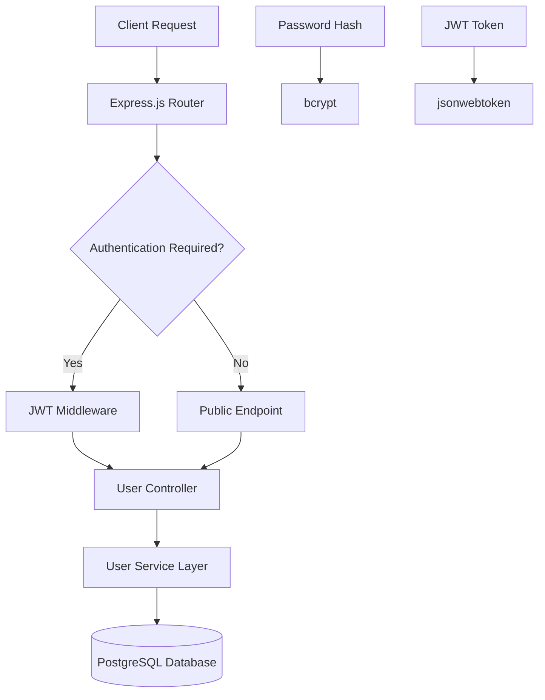

# User Service

## Authentication & User Management

The User Service is the security backbone of our e-commerce platform, handling all authentication, authorization, and user management operations.

## Key Responsibilities

- **User Authentication** - JWT-based login system
- **Authorization** - Role-based access control (RBAC)
- **Profile Management** - User data and preferences
- **Security** - Password encryption and validation
- **Session Management** - Token lifecycle and refresh

## Technical Architecture



## Database Design

### Users Table
```sql
CREATE TABLE users (
    id SERIAL PRIMARY KEY,
    email VARCHAR(255) UNIQUE NOT NULL,
    password_hash VARCHAR(255) NOT NULL,
    first_name VARCHAR(100),
    last_name VARCHAR(100),
    phone VARCHAR(20),
    role VARCHAR(50) DEFAULT 'customer',
    email_verified BOOLEAN DEFAULT false,
    created_at TIMESTAMP DEFAULT NOW(),
    updated_at TIMESTAMP DEFAULT NOW()
);

CREATE INDEX idx_users_email ON users(email);
CREATE INDEX idx_users_role ON users(role);
```

## API Endpoints

### Authentication Flow
1. **POST /auth/register** - Create new account
2. **POST /auth/login** - Authenticate user
3. **GET /auth/me** - Get current user info
4. **POST /auth/refresh** - Refresh JWT token
5. **POST /auth/logout** - Invalidate session

### User Management
- **GET /users/profile** - Get user profile
- **PUT /users/profile** - Update profile
- **POST /users/change-password** - Change password
- **DELETE /users/account** - Delete account

## Security Features

- **Password Hashing** - bcrypt with configurable rounds
- **JWT Tokens** - Stateless authentication
- **Rate Limiting** - Prevent brute force attacks
- **Input Validation** - Joi schema validation
- **SQL Injection Protection** - Parameterized queries
- **CORS Configuration** - Cross-origin request handling

## Performance & Monitoring

- **Health Checks** - `/health` endpoint
- **Metrics Collection** - Prometheus metrics
- **Database Connection Pooling** - Optimized PostgreSQL connections
- **Request Logging** - Structured logging with Winston
- **Error Tracking** - Comprehensive error handling

## Testing Strategy

- **Unit Tests** - Service layer and utilities
- **Integration Tests** - Database operations
- **API Tests** - Endpoint validation
- **Security Tests** - Authentication and authorization
- **Load Tests** - Performance benchmarking